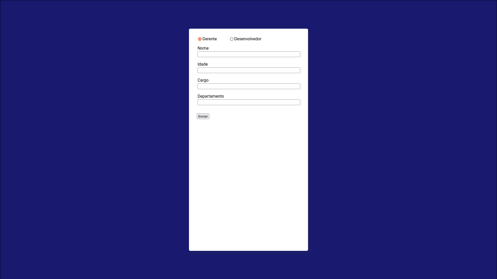

<h1 align="center">
    
</h1>

 <a href="#-sobre-o-projeto">Sobre</a> •
 <a href="#-funcionalidades">Funcionalidades</a> •
 <a href="#-como-executar-o-projeto">Como executar</a> • 
 <a href="#-tecnologias">Tecnologias</a> • 
 <a href="#-autor">Autor</a> • 
 <a href="#user-content--licença">Licença</a>

  

## 💻 Sobre o projeto

**Cadastro de Funcionários** é um simples formulário com HTML, CSS e JavaScript.

---

## ⚙️ Funcionalidades

- [x] Cadastrar Gerentes
- [x] Cadastrar Desenvolvedores
- [x] Validar erros de digitação
- [x] Exibir mensagens
 
---

## 🚀 Como executar o projeto

#### 🧭 Rodando a aplicação web

Clone o repositório e abra o arquivo index.html no browser de sua preferência.

---

## 🛠 Tecnologias

As seguintes ferramentas foram usadas na construção do projeto:

#### **Website**  ([HTML](https://developer.mozilla.org/pt-BR/docs/Web/HTML)  + [CSS](https://developer.mozilla.org/pt-BR/docs/Web/CSS) + [JavaScript](https://developer.mozilla.org/pt-BR/docs/Web/JavaScript))

#### **Utilitários**

-   Fontes:  **[Roboto](https://fonts.google.com/specimen/Roboto)**

---

## 🦸 Autor

<a href="https://github.com/gustavoferreiradev">
 
  
 <b>Gustavo Ferreira</b></a> <a href="https://github.com/gustavoferreiradev/" title="Gustavo Ferreira">🚀</a>
  
 
 
 

---

## 📝 Licença

Este projeto esta sob a licença [MIT](./LICENSE).

Feito com ❤️ por Gustavo Fereira 👋🏽 [Entre em contato!](https://www.linkedin.com/in/gustavofersilva/)

